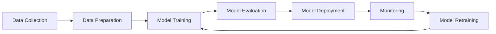

# MLOps Fundamentals: Operationalizing Machine Learning at Scale

Machine Learning Operations (MLOps) is a set of practices that aims to deploy and maintain machine learning models in production reliably and efficiently. It combines Machine Learning, DevOps, and Data Engineering to create an end-to-end ML workflow that can be automated, monitored, and reproduced at scale.

## The MLOps Lifecycle

The MLOps lifecycle consists of several interconnected stages:



### 1. Data Management

Effective data management is the foundation of successful MLOps:

#### Data Versioning
```python
# Example using DVC (Data Version Control)
import dvc.api

# Track data versions
data_url = dvc.api.get_url(
    path='data/training_set.csv',
    repo='https://github.com/example/ml-project',
    rev='v1.2.0'
)
```

#### Data Quality Checks
```python
import great_expectations as ge

# Define data expectations
def validate_data_quality(df):
    gdf = ge.from_pandas(df)
    
    # Check for null values
    gdf.expect_column_values_to_not_be_null('feature_1')
    
    # Check data ranges
    gdf.expect_column_values_to_be_between('age', 0, 120)
    
    # Check data types
    gdf.expect_column_values_to_be_of_type('user_id', 'int64')
    
    return gdf.validate()
```

### 2. Model Training and Experimentation

#### Experiment Tracking
MLflow is a popular tool for tracking experiments:

```python
import mlflow
import mlflow.sklearn
from sklearn.ensemble import RandomForestClassifier
from sklearn.metrics import accuracy_score

# Start MLflow run
with mlflow.start_run():
    # Log parameters
    mlflow.log_param("n_estimators", 100)
    mlflow.log_param("max_depth", 5)
    
    # Train model
    model = RandomForestClassifier(n_estimators=100, max_depth=5)
    model.fit(X_train, y_train)
    
    # Make predictions and log metrics
    predictions = model.predict(X_test)
    accuracy = accuracy_score(y_test, predictions)
    mlflow.log_metric("accuracy", accuracy)
    
    # Log model
    mlflow.sklearn.log_model(model, "random_forest_model")
```

#### Hyperparameter Optimization
```python
import optuna

def objective(trial):
    # Suggest hyperparameters
    n_estimators = trial.suggest_int('n_estimators', 10, 200)
    max_depth = trial.suggest_int('max_depth', 1, 20)
    
    # Train model with suggested parameters
    model = RandomForestClassifier(
        n_estimators=n_estimators,
        max_depth=max_depth,
        random_state=42
    )
    model.fit(X_train, y_train)
    
    # Return metric to optimize
    predictions = model.predict(X_val)
    return accuracy_score(y_val, predictions)

# Optimize hyperparameters
study = optuna.create_study(direction='maximize')
study.optimize(objective, n_trials=100)
```

### 3. Model Deployment Strategies

#### A/B Testing for Model Deployment
```python
import random

class ModelABTesting:
    def __init__(self, model_a, model_b, traffic_split=0.5):
        self.model_a = model_a
        self.model_b = model_b
        self.traffic_split = traffic_split
    
    def predict(self, X):
        if random.random() < self.traffic_split:
            return self.model_a.predict(X), "model_a"
        else:
            return self.model_b.predict(X), "model_b"
    
    def get_performance_metrics(self):
        # Return performance metrics for both models
        return {
            "model_a": self.model_a_metrics,
            "model_b": self.model_b_metrics
        }
```

#### Blue-Green Deployment
This strategy involves maintaining two identical production environments:

- **Blue Environment**: Current production model
- **Green Environment**: New model version

```yaml
# docker-compose.yml for blue-green deployment
version: '3.8'
services:
  model-blue:
    image: ml-model:v1.0
    ports:
      - "8000:8000"
    environment:
      - MODEL_VERSION=v1.0
      - ENVIRONMENT=blue
  
  model-green:
    image: ml-model:v1.1
    ports:
      - "8001:8000"
    environment:
      - MODEL_VERSION=v1.1
      - ENVIRONMENT=green
```

### 4. Monitoring and Observability

#### Model Performance Monitoring
```python
import numpy as np
from scipy import stats

class ModelMonitor:
    def __init__(self, baseline_predictions, threshold=0.05):
        self.baseline_predictions = baseline_predictions
        self.threshold = threshold
    
    def detect_drift(self, current_predictions):
        """Detect statistical drift using Kolmogorov-Smirnov test"""
        statistic, p_value = stats.ks_2samp(
            self.baseline_predictions, 
            current_predictions
        )
        
        if p_value < self.threshold:
            return True, f"Drift detected (p-value: {p_value:.4f})"
        return False, f"No drift detected (p-value: {p_value:.4f})"
    
    def calculate_prediction_metrics(self, y_true, y_pred):
        """Calculate real-time prediction metrics"""
        from sklearn.metrics import accuracy_score, precision_score, recall_score, f1_score
        
        return {
            "accuracy": accuracy_score(y_true, y_pred),
            "precision": precision_score(y_true, y_pred, average='weighted'),
            "recall": recall_score(y_true, y_pred, average='weighted'),
            "f1": f1_score(y_true, y_pred, average='weighted')
        }
```

#### Data Drift Detection
Data drift occurs when the input data distribution changes over time:

$$D_{KL}(P||Q) = \sum_{x} P(x) \log\left(\frac{P(x)}{Q(x)}\right)$$

Where $P$ is the reference distribution and $Q$ is the current distribution.

```python
def detect_data_drift(reference_data, current_data, feature_columns):
    """Detect data drift using statistical tests"""
    drift_results = {}
    
    for feature in feature_columns:
        ref_values = reference_data[feature]
        curr_values = current_data[feature]
        
        # Perform Kolmogorov-Smirnov test
        statistic, p_value = stats.ks_2samp(ref_values, curr_values)
        
        drift_results[feature] = {
            'statistic': statistic,
            'p_value': p_value,
            'drift_detected': p_value < 0.05
        }
    
    return drift_results
```

## MLOps Tools and Platforms

### Open Source Tools
- **MLflow**: Experiment tracking and model management
- **Kubeflow**: ML workflows on Kubernetes
- **Apache Airflow**: Workflow orchestration
- **DVC**: Data and model versioning
- **Great Expectations**: Data validation

### Cloud Platforms
- **AWS SageMaker**: End-to-end ML platform
- **Google Cloud AI Platform**: Managed ML services
- **Azure Machine Learning**: Enterprise ML platform

## Best Practices for MLOps

### 1. Automate Everything
```yaml
# GitHub Actions workflow for ML pipeline
name: ML Pipeline
on:
  push:
    branches: [main]
  
jobs:
  train-and-deploy:
    runs-on: ubuntu-latest
    steps:
      - uses: actions/checkout@v2
      
      - name: Setup Python
        uses: actions/setup-python@v2
        with:
          python-version: '3.8'
      
      - name: Install dependencies
        run: |
          pip install -r requirements.txt
      
      - name: Run data validation
        run: |
          python scripts/validate_data.py
      
      - name: Train model
        run: |
          python scripts/train_model.py
      
      - name: Evaluate model
        run: |
          python scripts/evaluate_model.py
      
      - name: Deploy if performance threshold met
        run: |
          python scripts/deploy_model.py
```

### 2. Implement Comprehensive Testing
```python
import pytest
import pandas as pd
from sklearn.datasets import make_classification

class TestMLModel:
    @pytest.fixture
    def sample_data(self):
        X, y = make_classification(n_samples=100, n_features=4, random_state=42)
        return pd.DataFrame(X), pd.Series(y)
    
    def test_model_training(self, sample_data):
        X, y = sample_data
        model = RandomForestClassifier()
        model.fit(X, y)
        assert hasattr(model, 'feature_importances_')
    
    def test_model_predictions(self, sample_data):
        X, y = sample_data
        model = RandomForestClassifier()
        model.fit(X, y)
        predictions = model.predict(X)
        assert len(predictions) == len(y)
        assert all(pred in [0, 1] for pred in predictions)
    
    def test_model_performance(self, sample_data):
        X, y = sample_data
        model = RandomForestClassifier(random_state=42)
        model.fit(X, y)
        accuracy = model.score(X, y)
        assert accuracy > 0.8  # Minimum performance threshold
```

### 3. Version Everything
- **Code**: Git for source code
- **Data**: DVC or similar tools
- **Models**: MLflow Model Registry
- **Environment**: Docker containers
- **Configs**: Configuration management tools

## Conclusion

MLOps is essential for building reliable, scalable machine learning systems. By implementing proper MLOps practices, organizations can:

- Reduce time to deployment
- Improve model reliability and performance
- Enable automated retraining and updates
- Ensure reproducibility and compliance
- Scale ML operations efficiently

The key to successful MLOps implementation is starting small, iterating frequently, and gradually building more sophisticated automation and monitoring capabilities.

---

*Next in our series: "AI System Architecture: Designing Scalable and Reliable AI Applications"* 